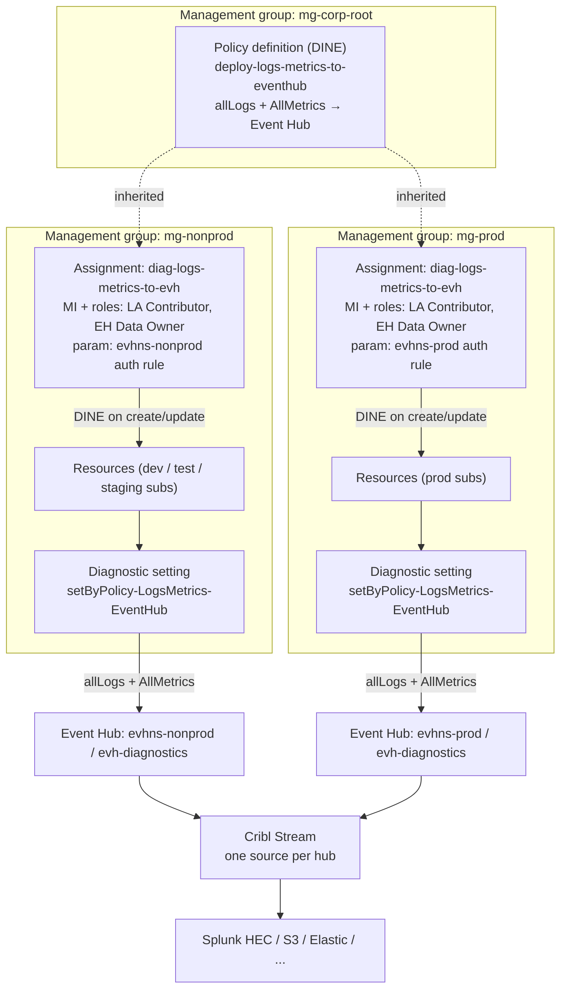
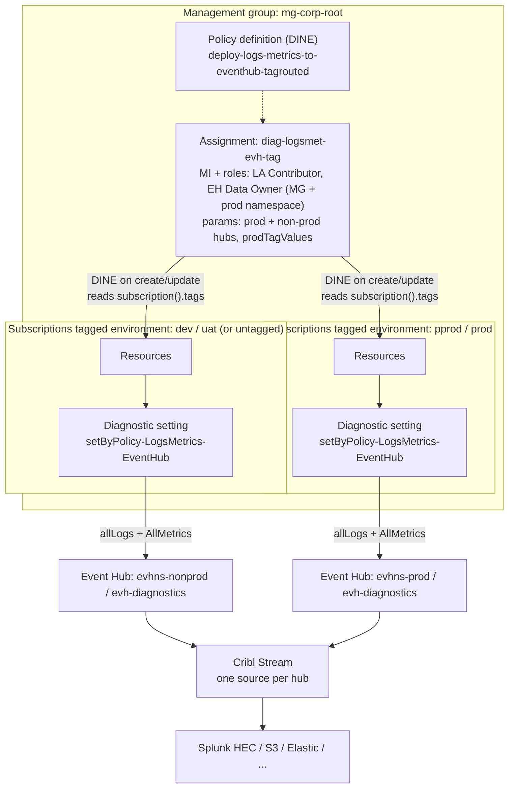

# Diagnostics policy architecture — one policy, two Event Hubs

Two ways to route each resource's diagnostics to a prod or non-prod Event Hub:

1. **[Two management groups](#variant-1--two-management-groups-two-assignments)** — one
   assignment per environment MG, each with static hub parameters (`terraform/policy_combined.tf`).
2. **[Subscription-tag routing](#variant-2--one-assignment-tag-based-routing)** — one
   assignment, hub chosen per subscription `environment` tag
   (`terraform/policy_combined_tagrouted.tf`, enabled with `diagnostics_eventhub_tag_routing = true`).

Both deploy the same single **DeployIfNotExists** diagnostic setting
(`setByPolicy-LogsMetrics-EventHub`, `allLogs` + `AllMetrics`); exactly one variant is
active at a time (the single-hub file gates itself off when tag routing is on).

## Variant 1 — two management groups, two assignments

A single custom **DeployIfNotExists** policy definition (`deploy-logs-metrics-to-eventhub`,
see `terraform/policy_combined.tf`) lives at the parent management group. Two assignments —
one per environment management group — parameterize it with a different Event Hub, so every
new or updated resource automatically streams `allLogs` + `AllMetrics` to the hub for its
environment.



### How a resource gets wired up

1. The policy definition is created once at `mg-corp-root`; both child management groups inherit it.
2. Each environment gets its own assignment. The only differences are the scope and the
   `eventHubAuthorizationRuleId` / `eventHubName` parameters, which point at that environment's
   namespace.
3. Each assignment carries a system-assigned managed identity, granted **Log Analytics
   Contributor** (writes `diagnosticSettings`) and **Azure Event Hubs Data Owner** (data-plane
   rights on the hub) at its management group scope.
4. When a resource whose type is in `resourceTypeList` is created or updated,
   DeployIfNotExists checks for a diagnostic setting pointing at the assignment's
   authorization rule.
5. If missing, a remediation deployment creates `setByPolicy-LogsMetrics-EventHub` on the
   resource — a single diagnostic setting streaming `allLogs` + `AllMetrics` to the
   environment's Event Hub, where Cribl picks it up.

### What differs between the two assignments

| Parameter | Non-prod assignment | Prod assignment |
|---|---|---|
| Scope | `mg-nonprod` | `mg-prod` |
| `eventHubAuthorizationRuleId` | auth rule on `evhns-nonprod` | auth rule on `evhns-prod` |
| `eventHubName` | `evh-diagnostics` (non-prod) | `evh-diagnostics` (prod) |
| `resourceTypeList` | Same curated list of metric-emitting types — keep the two assignments in lockstep | |
| `effect` | `DeployIfNotExists` (set to `AuditIfNotExists` to dry-run an environment) | |

## Variant 2 — one assignment, tag-based routing

When the MG hierarchy is not split by environment (or environments are mixed within an MG),
a single assignment can pick the hub from the **`environment` tag on the resource's
subscription**. `subscription()` is a supported policy function that resolves in the context
of the evaluated resource, so the policy reads the containing subscription's tags at
evaluation time — the same mechanism the built-in "Inherit a tag from the subscription"
policy uses.



The hub selection expression — used identically in the `existenceCondition` and the DINE
deployment parameters, so compliance and remediation always agree:

```
[if(contains(parameters('prodTagValues'),
     toLower(coalesce(tryGet(subscription().tags, parameters('environmentTagName')), '__untagged__'))),
   parameters('prodEventHubAuthorizationRuleId'),
   parameters('nonprodEventHubAuthorizationRuleId'))]
```

### Routing table

| Subscription `environment` tag | Target hub |
|---|---|
| `pprod`, `prod` (per `diagnostics_prod_tag_values`) | Prod Event Hub |
| `dev`, `uat` | Non-prod Event Hub |
| Any other value | Non-prod Event Hub |
| Tag missing | Non-prod Event Hub (safe default — `tryGet` prevents an evaluation error, which would otherwise be treated as deny) |

Comparison is case-insensitive: the tag value is lowercased before matching, so
`diagnostics_prod_tag_values` must be lowercase (enforced by a variable validation).

### Terraform toggles

| Variable | Purpose |
|---|---|
| `diagnostics_eventhub_tag_routing` | `true` enables this variant; `policy_combined.tf` gates itself off |
| `diagnostics_environment_tag_name` | Subscription tag name (default `environment`) |
| `diagnostics_prod_tag_values` | Lowercase values routed to prod (default `["pprod", "prod"]`) |
| `diagnostics_prod_eventhub_auth_rule_id` | Send rule on the prod namespace — **required** (precondition-enforced) |
| `diagnostics_prod_eventhub_name` | Prod hub name; defaults to the non-prod hub name |

The non-prod hub reuses the single-hub defaults (this project's namespace). The assignment's
managed identity gets the usual role pair at MG scope **plus** Event Hubs Data Owner directly
on the prod namespace, since that namespace may live outside the assigned MG.

## Choosing between the variants

| Aspect | Two MGs (variant 1) | Tag routing (variant 2) |
|---|---|---|
| MG hierarchy | Must split prod/non-prod | Any hierarchy works |
| Routing source of truth | MG placement (hard to get wrong) | Tag value (must be governed) |
| Mistagged/missing tag | Impossible state | Falls to non-prod hub |
| Compliance view | Clean per environment | Mixed, but existence check is per-sub correct |
| RBAC | Each identity → its own hub | One identity → both hubs |

If tag routing is adopted, tag hygiene becomes load-bearing — anyone who can edit
subscription tags can reroute telemetry. Pair it with a policy requiring
`environment ∈ {dev, uat, pprod, prod}` on subscriptions.

## Constraints to keep in mind (both variants)

- **One region per assignment.** An Event Hub diagnostic destination must be in the same
  region as the resource. Resources in other regions need an additional hub + assignment pair.
- **New and updated resources only.** DINE fires on create/update; existing resources need a
  remediation task per assignment.
- **Metric-emitting types only.** `AllMetrics` fails on types without platform metrics, which
  is why the policy gates on `resourceTypeList` instead of matching everything.
- **Metric dimensions are dropped** by diagnostic-settings export — a known trade-off versus
  the DCR platform-telemetry path.
- **≤ 5 diagnostic settings per resource**, and each Event Hub destination can only appear in
  one of them.
- **Runtime-unverified.** Both variants use the generic relative-scope deployment (and
  variant 2 additionally relies on policy functions in the existence condition) — validate
  with a test-MG assignment on one tagged and one untagged subscription before production.
