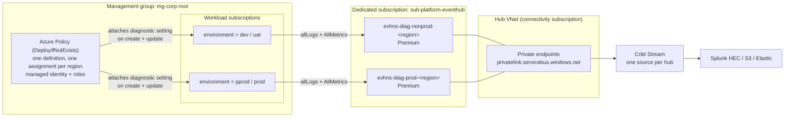

# Centralised diagnostics to Event Hub — tag-routed design

**For team review.** How we collect logs and metrics from every Azure resource in the estate,
and the proposed change: route them to the right Event Hub using a subscription tag instead of
splitting the management group hierarchy by environment.

## The solution in one paragraph

A single Azure Policy assigned at the root management group automatically attaches a
diagnostic setting to every supported resource as it is created or updated. That setting
streams `allLogs` + `AllMetrics` into an Event Hub, where Cribl Stream picks the telemetry up,
processes it once, and fans it out to the downstream destinations. No per-resource, per-team,
or per-subscription configuration is required — onboarding a new workload is automatic.

Two Event Hubs per region keep production telemetry separated from everything else, in a
dedicated Event Hub subscription reached over private endpoints. **The design question under
review is how a resource is matched to its hub.**

## Architecture



Diagnostic-setting delivery is an Azure Monitor platform path, not customer network traffic —
it reaches the namespace through the trusted-services bypass, not through the private endpoint.
The private endpoints exist for the *consumer* side (Cribl) and for management access.

**Layers:**

| Layer | Role |
|---|---|
| Azure Policy | Governance and enforcement — decides *what* is monitored and *where* it ships |
| Diagnostic settings | The per-resource plumbing the policy creates; native Azure telemetry export |
| Event Hub | Buffer and transport, one per environment tier |
| Cribl Stream | Parsing, reduction, routing to destinations |

The policy assignment carries a managed identity granted **Log Analytics Contributor** (to
write diagnostic settings) and **Azure Event Hubs Data Owner** (data-plane rights on the hubs).
Only metric-emitting resource types are targeted, via an explicit `resourceTypeList` — the
`AllMetrics` category fails on types that have no platform metrics.

## Event Hub platform design

### Placement and topology

All namespaces live in a **new dedicated subscription** (`sub-platform-eventhub`) under the
platform management group, separate from workloads and from connectivity. This gives the
ingestion platform its own quota envelope, its own cost centre, and an RBAC boundary that
workload teams have no standing access to — they produce into it via policy, they never
administer it.

A diagnostic setting can only target an Event Hub **in the same region as the monitored
resource** ([source](https://learn.microsoft.com/azure/azure-monitor/platform/diagnostic-settings#destinations):
*"Event hubs must be in the same region as the resource that you're monitoring if the resource
is regional"*), so the namespace count is `regions × tiers`. The same page confirms the
destination does **not** have to be in the same subscription, which is what makes the dedicated
subscription workable:

| Region | Non-prod namespace | Prod namespace | AZ support |
|---|---|---|---|
| Switzerland North | `evhns-diag-np-chn-001` | `evhns-diag-prd-chn-001` | Yes — zone redundant |
| Switzerland West | `evhns-diag-np-chw-001` | `evhns-diag-prd-chw-001` | **No** — single zone |
| Sweden Central | `evhns-diag-np-sec-001` | `evhns-diag-prd-sec-001` | Yes — zone redundant |

Six namespaces, one resource group per region, one event hub entity per namespace named
`evh-diagnostics`. Everything — logs and metrics, every resource type, every subscription in
that region and tier — lands in that single entity; Cribl does the splitting downstream. This
keeps the policy to one `authorizationRuleId` parameter pair per assignment and avoids
multiplying the assignment matrix.

### SKU and capacity

**Premium**, minimum 1 processing unit per namespace, sized per region:

| Namespace | Start at | Partitions | Retention |
|---|---|---|---|
| Prod, Switzerland North | 2 PU | 32 | 3 days |
| Prod, other regions | 1 PU | 16 | 3 days |
| Non-prod, all regions | 1 PU | 16 | 1 day |

Premium is the right tier here for reasons beyond throughput: resource isolation (a noisy
workload's log burst cannot starve another tenant), zone redundancy by default, dynamic
partition increase after creation (Standard partitions are immutable — a sizing mistake means
rebuilding the hub and re-pointing every diagnostic setting), 100 consumer groups instead of
20, and Capture included rather than billed hourly. Premium caps at 16 PU per namespace, which
is far above this workload.

Partition count sets the ceiling on Cribl's read parallelism — a consumer can run at most one
reader per partition per consumer group. Size partitions to Cribl's worker count, not to
ingest volume. Partitions can be increased later on Premium but never decreased, so start
moderate.

### Networking

| Setting | Value |
|---|---|
| `publicNetworkAccess` | `Disabled` |
| `trustedServiceAccessEnabled` | `true` |
| Private endpoints | One per namespace, in the hub VNet's PaaS subnet (connectivity subscription) |
| Private DNS zone | `privatelink.servicebus.windows.net`, owned in the connectivity subscription, linked to hub + all spokes |
| `minimumTlsVersion` | `1.2` |
| Local auth | Enabled (required — see below) |

The private endpoints sit in the **hub VNet**, not in the Event Hub subscription's own VNet.
Cross-subscription private endpoints are fully supported, and this keeps all Private Link
plumbing, DNS, and inspection in one place. Consumers resolve
`evhns-diag-*.servicebus.windows.net` to the private IP through the centrally-linked zone; the
platform team never manages a second copy of that zone. Cribl reaches the hubs from on-premises
over ExpressRoute/VPN, or from a spoke peered to the hub — both land on the same private
endpoints, and neither needs the public endpoint. Limit: 120 private endpoints per namespace,
far above what this needs.

**The two access paths are asymmetric, and this is the part to get right.** Consumers come in
through the private endpoint. Producers do not: Azure Monitor's diagnostic-setting delivery is
a first-party service path, not a private-endpoint client, so it reaches the namespace through
the **trusted-services bypass**. Azure Monitor (Diagnostic Settings and Action Groups) is an
explicitly listed trusted service, and the bypass remains available when public network access
is disabled — the portal's own "disable public access" flow keeps the trusted-services
exception as a step. So `publicNetworkAccess = Disabled` is safe here, but *only* with
`trustedServiceAccessEnabled = true`. Turn that flag off and ingestion stops from every
monitored resource while Cribl's private-endpoint reads keep working — the pipeline looks
healthy and carries no data. Treat it as a load-bearing setting, not a checkbox, and cover it
with a `Deny` policy or a drift alert.

**This posture is already proven in this repo.** `terraform/eventhub.tf` applied successfully
against Sweden Central with `public_network_access_enabled = false` and
`trusted_service_access_enabled = true` together, and the pipeline delivered. The six-namespace
design inherits a validated network configuration rather than a theoretical one.

Two implementation details that came out of that apply:

- `public_network_access_enabled = false` must be set **both** at the top level of
  `azurerm_eventhub_namespace` **and** inside the `network_rulesets` block, or the API rejects
  it with *"the value of public network access of namespace should be the same as of the
  network rulesets"*. `terraform plan` does not catch this.
- `default_action` is **ignored** when public access is disabled. The config asks for `Deny`;
  the applied state comes back `Allow`. This is Azure normalising — with no public endpoint
  there is no default action to apply — and it is precisely the boundary of the rule set that
  gets dropped: `default_action`, `ip_rule`, and `virtual_network_rule` are inert, while
  `trusted_service_access_enabled` is retained and honoured. Don't read the `Allow` in state as
  an open namespace, and don't chase the config/state difference.

### Identity and authorisation

| Principal | Mechanism | Right |
|---|---|---|
| Azure Monitor (diagnostic settings) | SAS authorization rule on the namespace | `Manage`, `Send`, `Listen` |
| Policy managed identity | Entra ID RBAC | Azure Event Hubs Data Owner + Log Analytics Contributor |
| Cribl Stream | SAS authorization rule, listen-only (see below) | `Listen` |
| Platform operators | Entra ID PIM | Contributor on the EH resource groups, just-in-time |

Diagnostic settings take an `eventHubAuthorizationRuleId` — a SAS rule — not a managed
identity, so **local auth cannot be disabled** on these namespaces. Grant that rule
`send = true`, `listen = false`, `manage = false`. The Azure Monitor docs describe streaming as
requiring Manage/Send/Listen, but in practice Azure Monitor only needs Send, and asking for
Manage is actively harmful: the API rejects `manage = true` unless `listen` and `send` are
*both* true (`InvalidCombinationOfRights`), which is how this repo's first apply failed.
Terraform reads the connection string through ARM RBAC, not through the SAS Manage right, so
send-only costs nothing operationally.

Cribl gets a **second, separate rule** with `listen = true` only — the split is the point, so
that a compromised consumer cannot inject telemetry and the producer credential cannot read it.
This mirrors what is deployed today (`DiagnosticsRule` / `CriblListenRule` in
`terraform/eventhub.tf`), where Cribl consumes via a connection string passed as a Container
App secret. Entra ID with the **Azure Event Hubs Data Receiver** role would be the stronger
option and is worth revisiting when Cribl's Event Hubs source is confirmed to support managed
identity in the version you run — it removes the last long-lived secret from the design. Until
then, keep the listen rule scoped and rotate it on the same cadence as other platform secrets.

Note the hard cap of **12 authorization rules per namespace**. Two rules per namespace — one
send, one listen — is well inside it; a per-team or per-workload rule scheme would not be.

### Reliability

Zone redundancy in-region, no cross-region failover. A regional Event Hubs outage means a
diagnostics gap for that region — but in that scenario the monitored resources are largely down
too, and the telemetry that matters most is emitted by the control plane and by Azure Monitor
itself, which are not hosted on this hub. Geo-DR would only replicate metadata (aliases,
consumer groups), not buffered events, so it would not save a single log line; geo-replication
would, at roughly double the cost, for data whose value expires in hours. Accepting the outage
is the right call.

**Switzerland West is the exception.** It has no availability zones, so its two namespaces are
single-zone regardless of Premium tier, and the region is access-restricted — it is enrolled
per-subscription as a DR target for Switzerland North rather than being generally available.
Confirm the dedicated subscription is entitled to Switzerland West and that Event Hubs Premium
is offered there before committing to the six-namespace layout. If either check fails, fold
Switzerland West resources onto Switzerland North hubs and accept that those diagnostic
settings will be rejected by the same-region rule — which in practice means Switzerland West
workloads get no Event Hub diagnostics at all, and need a Log Analytics destination instead
(Log Analytics has no same-region constraint).

### Retention cost — flag for the review

Retention is the cost lever that surprises people. Premium includes 1 TB of event storage per
processing unit; beyond that, retained data is billed at Azure Blob rates.

| Sustained ingest | Per day | 3-day retention |
|---|---|---|
| 10 MB/s | ~0.86 TB | ~2.6 TB |
| 50 MB/s | ~4.3 TB | ~13 TB |

At the top of the stated 10–50 MB/s range, three days of retention needs on the order of 13 PU
of included storage to avoid overage — far more than the throughput requires. Retention on this
hub is a **replay buffer for a downstream outage**, not an archive. Recommendation: start at
**1 day** everywhere, measure actual ingest per namespace for a fortnight, then raise prod only
if the observed volume makes it cheap. If a longer replay window is genuinely needed, enable
**Event Hubs Capture** to a storage account (included in Premium) — cold storage at blob prices
beats paying Event Hubs to hold it.

### Terraform layout

Same repository, separate state per stack, applied in order:

| Stack | Owns | Consumes |
|---|---|---|
| `stacks/eventhub-platform` | Subscription-scoped: RGs, 6 namespaces, hub entities, consumer groups, SAS rules, private endpoints | Hub VNet subnet ID, DNS zone ID |
| `stacks/diagnostics-policy` | MG-scoped: definition, one assignment per region, role assignments | Auth rule IDs from the platform stack |

The interface between them is the set of `eventHubAuthorizationRuleId` values, passed via
remote state or a data source rather than hardcoded. The policy stack must never create hubs,
and the platform stack must never assume a management group — that separation is what lets the
hubs be rebuilt or resized without touching governance.

## The proposed change: tag-based hub selection

Today's design assumes the MG hierarchy is split into `mg-prod` and `mg-nonprod`, with a
separate assignment under each, hard-wired to its hub. The alternative is **one assignment**
that reads the `environment` tag on the resource's subscription and picks the hub at
evaluation time:

```
[if(contains(parameters('prodTagValues'),
     toLower(coalesce(tryGet(subscription().tags, parameters('environmentTagName')), '__untagged__'))),
   parameters('prodEventHubAuthorizationRuleId'),
   parameters('nonprodEventHubAuthorizationRuleId'))]
```

| Subscription `environment` tag | Target hub |
|---|---|
| `pprod`, `prod` | Prod Event Hub |
| `dev`, `uat` | Non-prod Event Hub |
| Any other value, or tag missing | Non-prod Event Hub (safe default) |

`subscription()` is a supported policy function that resolves against the evaluated resource's
subscription — the same mechanism the built-in "Inherit a tag from the subscription" policy
uses. The identical expression drives the `existenceCondition`, so compliance reporting and
remediation always agree on which hub is expected. Matching is case-insensitive, and `tryGet`
prevents an evaluation error on untagged subscriptions, which Azure would otherwise treat as
an implicit deny.

| | Two MGs (today) | Tag routing (proposed) |
|---|---|---|
| MG hierarchy | Must be split prod / non-prod | Any hierarchy works |
| Routing source of truth | MG placement | Subscription tag |
| Mistagged / missing tag | Impossible state | Falls back to non-prod hub |
| RBAC | Each identity → its own hub | One identity → both hubs |

## What we need decided

1. **Is tag hygiene acceptable as the control?** Anyone able to edit subscription tags can
   reroute telemetry, including sending prod logs to the non-prod hub. Mitigation is a
   companion policy denying subscriptions whose `environment` tag falls outside
   `{dev, uat, pprod, prod}`.
2. **Runtime validation is outstanding.** The generic relative-scope deployment and the policy
   functions in the existence condition need a test-MG assignment covering one tagged and one
   untagged subscription before production rollout.
3. **Region constraint applies either way — now implemented.** Tag routing selects the *tier*;
   the assignment's region selects the *region*. Both dimensions are needed, and the region
   dimension is guarded twice:

   - a `location` condition in the policy rule (`field: location in
     parameters('resourceLocations')`), which travels with the definition; and
   - `resourceSelectors` of `kind: resourceLocation` on each assignment, so out-of-region
     resources are never evaluated and compliance reporting stays clean.

   Both layers matter. `resourceSelectors` is an assignment property that anyone with
   assignment write access can drop; the rule condition cannot be removed by editing an
   assignment. Without either, all three assignments match every resource in the estate, the
   out-of-region ones fail permanently against the same-region rule, and — because each
   `existenceCondition` checks for *its own* hub's auth rule ID — they overwrite each other's
   diagnostic setting in a remediation flap.

   Driven by `var.diagnostics_regions`, a map keyed by region. **Switzerland North is the
   primary region** and additionally carries `global`: non-regional resources have no
   same-region constraint, but a strict per-region filter would otherwise exclude them from
   every assignment. Exactly one region may be primary — a second would put two assignments in
   competition over the same global resource — and that is enforced by variable validation.
4. **Trusted-services bypass must be protected.** Public access is disabled and consumers use
   private endpoints, but producer-side delivery from Azure Monitor depends entirely on
   `trustedServiceAccessEnabled = true`. Nothing about the pipeline looks broken if it is
   turned off. Add a `Deny` policy or a drift alert on that property.
5. **Switzerland West entitlement.** Confirm the new subscription can deploy to Switzerland
   West and that Event Hubs Premium is available there; if not, Switzerland West workloads
   need a Log Analytics destination instead of Event Hub.

## Implementation

| File | Contents |
|---|---|
| `terraform/policy_combined_tagrouted.tf` | Definition, assignment, role assignments |
| `terraform/policy_combined_tagrouted.portal.json` | Portal / `az policy definition create` export |
| `terraform/policy_combined_tagrouted.assignment-params.portal.json` | Example assignment parameters |
| `diagnostics-policy-architecture.md` | Detailed reference — both variants, full diagrams |

Both policy stacks fan out over `var.diagnostics_regions` with one assignment, one
system-assigned identity, and one set of role grants per region:

| Region | `short` | Logs assignment | Tag-routed assignment | Serves |
|---|---|---|---|---|
| Switzerland North | `chn` | `diag-logs-evh-chn` | `diag-logsmet-evh-chn` | `switzerlandnorth` + `global` |
| Switzerland West | `chw` | `diag-logs-evh-chw` | `diag-logsmet-evh-chw` | `switzerlandwest` |
| Sweden Central | `sec` | `diag-logs-evh-sec` | `diag-logsmet-evh-sec` | `swedencentral` |

`short` is capped at 6 characters and must be unique — management group assignment names cap
at 24, and the longest generated name is 20. Leaving `diagnostics_regions` empty keeps the
original single-region behaviour *and* the original assignment names, so an existing
single-region deployment is not forced into a replace by this change.

One asymmetry between the two stacks: the built-in logs initiative filters internally on its
`resourceLocation` parameter, which is a single region and cannot include `global`, so
**non-regional resources are not covered by the built-in logs path in any region**. The custom
tag-routed policy does cover them, via the primary region.

Enable with `diagnostics_eventhub_tag_routing = true`; the existing single-hub policy gates
itself off so exactly one variant ever deploys.

The Event Hub platform described above is **not yet built at scale**. Today's
`terraform/eventhub.tf` deploys a single proven namespace — `evhns-event-hub-demo`, Standard
tier, 1 TU with auto-inflate to 20, 4 partitions, 7-day retention, Sweden Central — with the
network posture, SAS split, private endpoint, and DNS zone all validated by a successful apply.
That is the template; the work is generalising it.

| Carries forward as-is | Changes for the platform build |
|---|---|
| Network posture (disabled + trusted bypass, set at both levels) | Standard → **Premium**, which is a namespace **replace**, not an update |
| Send-only / listen-only SAS rule split | One namespace → six, keyed on region × tier |
| Private endpoint + `privatelink.servicebus.windows.net` | DNS zone moves to the connectivity subscription; the local zone in `eventhub.tf` is dev-only |
| Dedicated `cribl` consumer group | Partition count and retention re-sized per the tables above |

Because the SKU change forces a rebuild, do it as part of the move into
`stacks/eventhub-platform` rather than in place — a namespace replace invalidates every
`eventHubAuthorizationRuleId` the policy assignments reference, so the two stacks must be
applied in order with the auth rule IDs flowing through remote state.

## References

The constraints this design is built on, with the statements they rest on:

| Claim | Source |
|---|---|
| Event Hub destination must be in the **same region** as a regional monitored resource | [Diagnostic settings — Destinations](https://learn.microsoft.com/azure/azure-monitor/platform/diagnostic-settings#destinations): *"Event hubs must be in the same region as the resource that you're monitoring if the resource is regional."* Restated in the general constraints: *"For regional resources, the destination must be in the same region as the monitored resource (applies to Storage accounts and Event Hubs)."* |
| Destination may live in a **different subscription** | Same page: *"The destination doesn't have to be in the same subscription as the resource that's sending logs if the user who configures the setting has appropriate Azure RBAC access to both subscriptions."* |
| Log Analytics has **no** region constraint (the Switzerland West fallback) | [Monitor Azure Cache for Redis using diagnostic settings](https://learn.microsoft.com/azure/azure-cache-for-redis/cache-monitor-diagnostic-settings#log-destinations): *"The workspace doesn't need to be in the same region as the resource being monitored."* |
| Trusted-services bypass is required, and Azure Monitor is a trusted service | [Diagnostic settings — Destinations](https://learn.microsoft.com/azure/azure-monitor/platform/diagnostic-settings#destinations) and [Event Hubs private endpoints — Trusted Microsoft services](https://learn.microsoft.com/azure/event-hubs/private-link-service#trusted-microsoft-services), which lists *"Azure Monitor (Diagnostic Settings and Action Groups)"* |
| Bypass survives disabled public access | [Event Hubs private endpoints](https://learn.microsoft.com/azure/event-hubs/private-link-service) — the *Disable public access* procedure retains the trusted-services exception as a step; corroborated by the working apply in `terraform/eventhub.tf` |
| Max 5 diagnostic settings per resource | [Diagnostic settings — Destinations](https://learn.microsoft.com/azure/azure-monitor/platform/diagnostic-settings#destinations) |
| Premium tier limits (16 PU, 90-day retention, 1 TB storage/PU, dynamic partitions) | [Event Hubs quotas and limits](https://learn.microsoft.com/azure/event-hubs/event-hubs-quotas#basic-vs-standard-vs-premium-vs-dedicated-tiers) and [Compare tiers](https://learn.microsoft.com/azure/event-hubs/compare-tiers#quotas) |
| 12 authorization rules per namespace; 120 private endpoints per namespace | [Event Hubs quotas — common limits](https://learn.microsoft.com/azure/event-hubs/event-hubs-quotas) and [Private endpoints — limitations](https://learn.microsoft.com/azure/event-hubs/private-link-service#limitations-and-design-considerations) |
| Switzerland West has no availability zones; Switzerland North is its pair | [Azure regions list](https://learn.microsoft.com/azure/reliability/regions-list#azure-regions-list) |
| Metric dimensions are flattened on export | [Diagnostic settings — Metrics limitations](https://learn.microsoft.com/azure/azure-monitor/platform/diagnostic-settings#metrics-limitations) |

Two caveats on the Microsoft docs, both found by applying this in practice:

1. The Event Hubs destination row states that *"Streaming to event hubs requires `Manage`,
   `Send`, and `Listen` permissions."* In practice a **send-only** rule works, and requesting
   `Manage` fails with `InvalidCombinationOfRights` unless `Listen` and `Send` are both set.
   The deployed `DiagnosticsRule` is send-only.
2. Delivery can take **up to 90 minutes** to start after a diagnostic setting is created, and
   an inactive resource backs off to as much as a two-hour export interval. Budget for that
   when validating the policy on a test MG — an empty hub in the first hour is not a failure.
