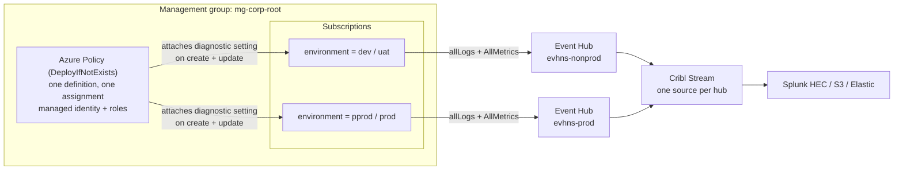

# Centralised diagnostics to Event Hub — tag-routed design

**For team review.** How we collect logs and metrics from every Azure resource in the estate,
and the proposed change: route them to the right Event Hub using a subscription tag instead of
splitting the management group hierarchy by environment.

## The solution in one paragraph

A single Azure Policy assigned at the root management group automatically attaches a
diagnostic setting to every supported resource as it is created or updated. That setting
streams `allLogs` + `AllMetrics` into an Event Hub, where Cribl Stream picks the telemetry up,
processes it once, and fans it out to the downstream destinations. No per-resource, per-team,
or per-subscription configuration is required — onboarding a new workload is automatic.

Two Event Hubs keep production telemetry separated from everything else. **The design question
under review is how a resource is matched to its hub.**

## Architecture



**Layers:**

| Layer | Role |
|---|---|
| Azure Policy | Governance and enforcement — decides *what* is monitored and *where* it ships |
| Diagnostic settings | The per-resource plumbing the policy creates; native Azure telemetry export |
| Event Hub | Buffer and transport, one per environment tier |
| Cribl Stream | Parsing, reduction, routing to destinations |

The policy assignment carries a managed identity granted **Log Analytics Contributor** (to
write diagnostic settings) and **Azure Event Hubs Data Owner** (data-plane rights on the hubs).
Only metric-emitting resource types are targeted, via an explicit `resourceTypeList` — the
`AllMetrics` category fails on types that have no platform metrics.

## The proposed change: tag-based hub selection

Today's design assumes the MG hierarchy is split into `mg-prod` and `mg-nonprod`, with a
separate assignment under each, hard-wired to its hub. The alternative is **one assignment**
that reads the `environment` tag on the resource's subscription and picks the hub at
evaluation time:

```
[if(contains(parameters('prodTagValues'),
     toLower(coalesce(tryGet(subscription().tags, parameters('environmentTagName')), '__untagged__'))),
   parameters('prodEventHubAuthorizationRuleId'),
   parameters('nonprodEventHubAuthorizationRuleId'))]
```

| Subscription `environment` tag | Target hub |
|---|---|
| `pprod`, `prod` | Prod Event Hub |
| `dev`, `uat` | Non-prod Event Hub |
| Any other value, or tag missing | Non-prod Event Hub (safe default) |

`subscription()` is a supported policy function that resolves against the evaluated resource's
subscription — the same mechanism the built-in "Inherit a tag from the subscription" policy
uses. The identical expression drives the `existenceCondition`, so compliance reporting and
remediation always agree on which hub is expected. Matching is case-insensitive, and `tryGet`
prevents an evaluation error on untagged subscriptions, which Azure would otherwise treat as
an implicit deny.

| | Two MGs (today) | Tag routing (proposed) |
|---|---|---|
| MG hierarchy | Must be split prod / non-prod | Any hierarchy works |
| Routing source of truth | MG placement | Subscription tag |
| Mistagged / missing tag | Impossible state | Falls back to non-prod hub |
| RBAC | Each identity → its own hub | One identity → both hubs |

## What we need decided

1. **Is tag hygiene acceptable as the control?** Anyone able to edit subscription tags can
   reroute telemetry, including sending prod logs to the non-prod hub. Mitigation is a
   companion policy denying subscriptions whose `environment` tag falls outside
   `{dev, uat, pprod, prod}`.
2. **Runtime validation is outstanding.** The generic relative-scope deployment and the policy
   functions in the existence condition need a test-MG assignment covering one tagged and one
   untagged subscription before production rollout.
3. **Region constraint applies either way.** An Event Hub destination must sit in the same
   region as the resource, so a multi-region estate needs an additional hub and assignment
   pair regardless of which variant we choose.

## Implementation

| File | Contents |
|---|---|
| `terraform/policy_combined_tagrouted.tf` | Definition, assignment, role assignments |
| `terraform/policy_combined_tagrouted.portal.json` | Portal / `az policy definition create` export |
| `terraform/policy_combined_tagrouted.assignment-params.portal.json` | Example assignment parameters |
| `diagnostics-policy-architecture.md` | Detailed reference — both variants, full diagrams |

Enable with `diagnostics_eventhub_tag_routing = true`; the existing single-hub policy gates
itself off so exactly one variant ever deploys.
